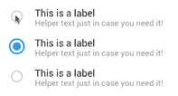

# md-radio
> Material Design animated radio input component



This is the plain HTML version. See [alternate versions](#alternate-versions).

## Installation
```bash
bower install md-radio
```

## Alternate Versions

* Web Component (TODO)
* Polymer Component (TODO)
* Angular 1.x Directive (TODO)
* Angular 2.x Component (TODO)
* React Component (TODO)
* Riot JS Component (TODO)

## Building from Source Files
Requires you have `node-sass` and/or any other SASS/SCSS-capable build tool installed.

If resorting to `node-sass` alone, run:
```
node-sass --output-style compressed sass/md-radio.sass md-radio.css
```
